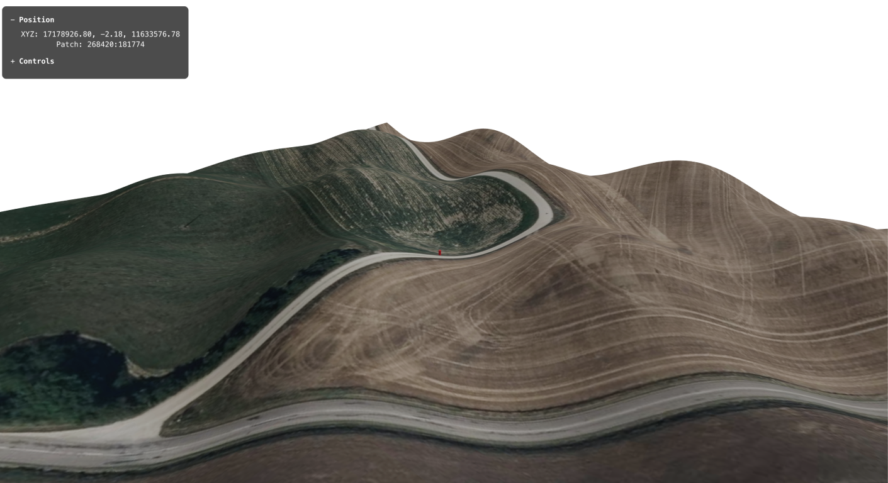

# Tile based LIDAR terrain viewer

## Progress

### Stage 1: Dynamic patch based terrain**  ✅ **COMPLETE**

### Stage 2: Satellite imagery tiles integration ✅ **COMPLETE**

### Stage 3: LIDAR point cloud
show point cloud above tile based terrain

### Stage 4: LIDAR integration with terrain patch
use point cloud to shape terrain height

## Results

