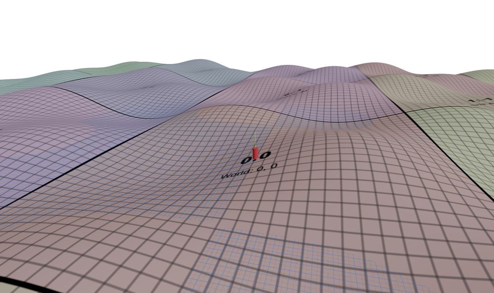

# STAGE1: Dynamic patch based terrain

## Architecture
### Planned hierarchy
```
App/
├── TerrainScene           # Main R3F scene + orchestration
├── Player                 # Cylinder + movement controls  
├── usePatchPolling        # Hook for patch visibility logic
└── TerrainPatch           # Individual terrain patch mesh
```

### Components: Roles & Responsabilities

**TerrainScene (Main Container)**
- Fixed fullscreen Canvas with proper positioning
- CameraControls integration for third-person camera
- Grid and axesHelper for reference (kept throughout all phases)
- Player position state management
- Calls usePatchPolling with player position and tileRange
- Renders all visible patches returned by hook
- **Exported as arrow function**

**Player**
- Cylinder mesh with WASD controls (using KeyCode for French AZERTY support)
- Third-person camera system: orbits around player, movement relative to camera direction
- Camera always follows player position as target
- Surface-following movement with terrain height sampling
- **Camera-relative movement**: W/S forward/backward, A/D left/right relative to camera view
- **Full orbiting**: Mouse drag rotates camera around player, scroll zooms

**usePatchPolling (React Hook)**
- Input: Player position, tileRange
- Maintains patch index map (patchId → patchData)
- Uses Grid System utilities to calculate visible patches
- Returns array of visible patchIds in format `"gridX:gridZ"`
- **Note**: Will recreate all patches on every render (optimization deferred)

**TerrainPatch**
- Props: { patchId }
- Derives position and size from patchId using Grid System
- PlaneGeometry with height displacement (sine wave function)
- Grid-aligned positioning with proper plane orientation
- **64x64 unit patches** with 32x32 subdivisions
- **Proper plane orientation with rotation={[-Math.PI / 2, 0, 0]}**

**Utility Functions**
- Convert world coordinates to grid coordinates
- Convert grid coordinates to world coordinates  
- Calculate visible patches within tileRange
- Generate patchIds in `"gridX:gridZ"` format
- **Fixed patch size: 64x64 units**

**GeoTilesProvider**
- assume 1:1 tile <> patch

## Incremantal steps

### Step#1: Basic scene setup ✅ **COMPLETE**
- TerrainScene with fixed fullscreen Canvas (position: fixed)
- CameraControls integration
- Built-in Grid component from @react-three/drei
- Built-in axesHelper for coordinate reference

### Step#2: Single Terrain Patch ✅ **COMPLETE**
- TerrainPatch component with sine wave height displacement
- PlaneGeometry with 32x32 subdivisions
- **Plane orientation fix**: rotation={[-Math.PI / 2, 0, 0]} to align with grid
- Vertex manipulation with proper normals calculation
- **TerrainScene exported as arrow function**

### Step#3: Player Movement ✅ **COMPLETE**
- Player cylinder with WASD controls using KeyCode (French AZERTY compatible)
- Third-person camera system with orbiting capability
- Camera always follows player as target with smooth tracking
- Movement relative to camera direction (not fixed world axes)
- Position tracking and terrain height following
- Grid and axesHelper remain for reference

### Step#4: Dynamic Patch System ✅ **COMPLETE**
- Implement Grid System utility functions
- Implement usePatchPolling hook returning visible patchIds
- Update TerrainScene to use hook and render multiple patches
- Replace single patch with dynamic patch rendering
- Grid and axesHelper remain for debugging/reference

### Final step: 
**stabilization**
- [x] fix: terrain patches seamless issue at junction: issue only occurs on Z and not X axis (probably due to plane rotation)
- [x] fix: after a while player position is unsync with terrain elevation
- [x] improvement: camera should also move to remain at fixed distanced from player while still maintaining zoom and orbit adjustment
- [-] improvement: while moving player camera don't maintain its vertical angle but tends to move towards ground (postponed on separate branch)
**patches system optimizations**
- [ ] investigation(patches): Add debug logs to see which patches are recreated at each hook call
- [ ] optimization(patches): useMemo for patches according to their id to avoid unnecessary rebuild
- [ ] refactor(`usePatchPolling`): store internal patch index inside the hook and use for comparision to know when patch index changes. Skip updating if no changes detected
**others**
- [x] match initially planned files splitting hierarchy
- [ ] update docs: README.md, ARCHITECTURE.md
- [ ] fix: TS types

## Result
### Preview


### Pitfalls
- seamless issue at patches' edge on Z axis due to induced loss of precision with `Plane` rotation 
- maintain camera distance to player while still allow orbiting and zooming
- maintain camera vertical orbiting angle while player is moving

### Sidenotes
- Fixed positioning for true fullscreen Canvas
- Keep Grid and axesHelper throughout all phases for reference
- Use built-in R3F/drei components where available (Grid, axesHelper)
- React state for player position (simple and reactive)
- **KeyCode-based input for international keyboard support**
- **Third-person camera with player-centric orbiting and camera-relative movement**
- **Camera target always locked to player position**


