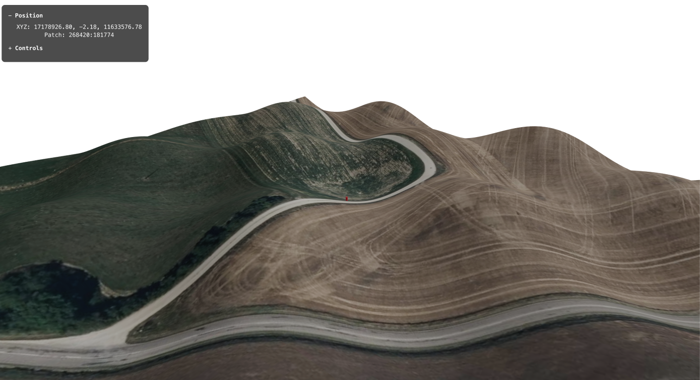

# STAGE 2 Satellite Imagery Tile Integration

## Specifications

### Assumptions
- 1:1 correspondence between terrain patches and satellite tiles
- **Tile service** Use French IGN WMTS with TileMatrix=19 (zoom level 19)

### UI System Specifications

**Design Requirements**:
- **Non-intrusive**: Semi-transparent background, positioned to avoid gameplay interference
- **Expandable**: Collapsible panels for different information categories
- **Readable**: High contrast text, appropriate font sizes
- **Responsive**: Updates in real-time with game state changes

**Information Panels**:
- **Position**: Player coordinates, current patch, tile calculations
- **Performance**: FPS
- **Controls**: Keyboard shortcuts, toggle options


### Architecture Changes
- **Coordinate system**: Use WMTS tile coordinates (tileCol:tileRow) as primary patch identifiers
- **State management**: Global currentPatch state tracking for optimized patch polling
- **UI System**: Global overlay UI for real-time information display

### Component Modifications

**TerrainScene (Global State Management)**
- **NEW**: `currentPatch` state with `tileCol:tileRow` format
- **NEW**: Watch `playerPosition` changes to update `currentPatch` when crossing patch boundaries
- **NEW**: Call `usePatchPolling` only when `currentPatch` changes (optimization)
- **NEW**: Integrate UI overlay system

**TerrainPatch (Texture System Refactor)**
- **NEW**: Use texture hook for patch-specific textures

**usePatchPolling (Optimized Triggering)**
- **Input**: currentPatch, tileRange
- **Output**: Array of visible patchIds in format `"tileCol:tileRow"`
- **Behavior**: Only recalculates when currentPatch changes (not every frame)

### New Components

**components/UI/OverlayUI.tsx**
```typescript
interface OverlayUIProps {
  playerPosition: [number, number, number];
  currentPatch: string;
}
// Fixed position overlay with multiple information panels
// Expandable/collapsible sections
// Semi-transparent background with readable text
```

**hooks/usePatchProceduralTexture.tsx**
```typescript
function usePatchProceduralTexture(patchId: string): THREE.CanvasTexture;
// Moved from TerrainPatch component
// Takes patchId in "tileCol:tileRow" format
// Returns customized procedural texture
```

**hooks/useImageryTiles.tsx**
```typescript
function useImageryTiles(patchId: string): THREE.Texture | null;
// Parses patchId to tileCol:tileRow
// Builds IGN WMTS URL
// Fetches satellite imagery
// Returns texture when loaded, null during loading
```

## Incremental Implementation Steps

### STEP #1: Global State Refactor  ✅ **COMPLETE** 

***NOTE: tileCol, tileRow default value must be provided***

**TerrainScene modifications**:
```typescript
// NEW state management
const [currentPatch, setCurrentPatch] = useState<string>("tileCol:tileRow");
const [playerPosition, setPlayerPosition] = useState<[number, number, number]>([0, 0, 0]);

// NEW effect to update currentPatch when player moves
useEffect(() => {
  const newPatch = calculateCurrentPatch(playerPosition);
  if (newPatch !== currentPatch) {
    setCurrentPatch(newPatch);
  }
}, [playerPosition]);

// UPDATED patch polling - only when currentPatch changes
const visiblePatchIds = usePatchPolling(currentPatch, tileRange);
```

**TerrainPatch refactor**:
```typescript
// NEW hook-based texture system
const patchTexture = usePatchProceduralTexture(patchId);

// KEEP existing geometry generation
// UPDATE position calculation to use tile coordinates
```

**New hook: usePatchProceduralTexture**:
```typescript
// Move generatePatchTexture logic to dedicated hook
function usePatchProceduralTexture(patchId: string): THREE.CanvasTexture {
  const [tileCol, tileRow] = patchId.split(':').map(Number);
  // Generate procedural texture based on tile coordinates
}
```

**Expected result**: Player spawns at patch labeled "tileCol:tileRow"

### STEP #1.5: UI System Foundation ✅ **COMPLETE** 

**OverlayUI Component**:
```typescript
// Multi-panel overlay system
// Position Panel: Player coordinates, current patch
// Performance Panel: FPS
// Controls Panel: Toggle visibility, expand/collapse sections
// Styling: Semi-transparent, readable, non-intrusive
```

**TerrainScene UI Integration**:
```typescript
// Add OverlayUI component outside Canvas
// Pass real-time state data
// Position as fixed overlay
// Handle UI state management
```

**Features**:
- **Position tracking**: Real-time player coordinates and patch info
- **Performance monitoring**: FPS counter,
- **Expandable sections**: Collapsible panels for different info types
- **Toggle visibility**: Show/hide overlay with keyboard shortcut

**Expected result**: Professional overlay UI showing real-time game state information

### STEP #2: Basic useImageryTiles Hook ✅ **COMPLETE** 

**New hook implementation**:
```typescript
function useImageryTiles(patchId: string): THREE.Texture | null {
  const [tileCol, tileRow] = patchId.split(':').map(Number);
  
  const url = `https://data.geopf.fr/wmts?layer=ORTHOIMAGERY.ORTHOPHOTOS&style=normal&tilematrixset=PM&Service=WMTS&Request=GetTile&Version=1.0.0&Format=image%2Fjpeg&TileMatrix=19&TileCol=${tileCol}&TileRow=${tileRow}`;
  
  // Fetch and return texture
}
```

**Testing integration in TerrainScene**:
```typescript
// TEMPORARY: Test tile fetching alongside existing system
const testTileTexture = useImageryTiles(currentPatch);

// Monitor network activity as player moves
useEffect(() => {
  console.log('Fetching tile for patch:', currentPatch);
}, [currentPatch]);
```

**Expected result**: Network requests visible in browser DevTools as player moves

### STEP #3: Integration with Patch System ✅ **COMPLETE**

**TerrainPatch final integration**:
```typescript
// REPLACE procedural texture with satellite imagery
const patchTexture = useImageryTiles(patchId);

// FALLBACK: Use procedural texture during loading
const proceduralTexture = usePatchProceduralTexture(patchId);
const finalTexture = patchTexture || proceduralTexture;
```

**Expected result**: All patches display satellite imagery with procedural fallback


### Final Step 
***list remaining bugs, refactoring tasks, improvements, optimizations,  ... here***
- [x] fix infinite rerendering loop even when scene is static
- [x] fix prevent patch rerender when patchid doesn't change

## Final Result
- IGN satellite imagery on all terrain patches
- UI overlay 



### Comments
- rescoped with minimal UI integration